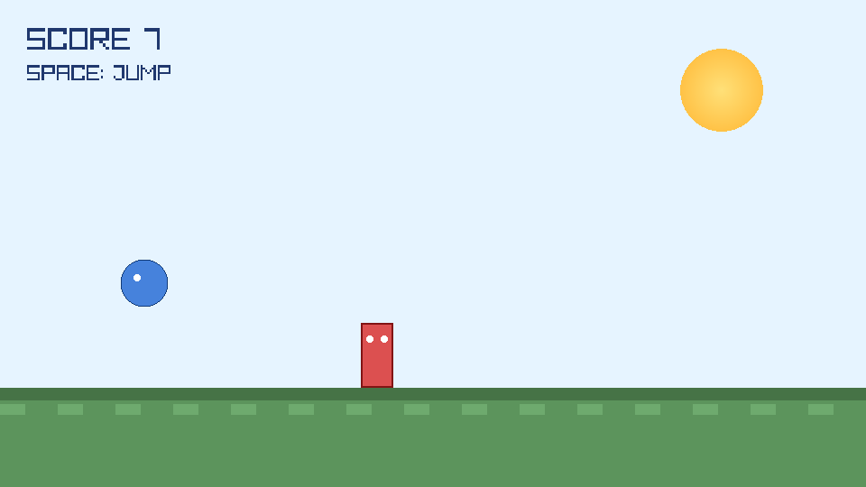

# Jump Game

`raylib` を使って作った、ボールをジャンプさせて敵を避けるシンプルなアクションゲームです。



## ゲーム内容

- 青い球を操作します
- `Space` キーでジャンプします
- 右から流れてくる敵にぶつかるとゲームオーバーです
- 敵を避けるたびにスコアが増えます
- ゲームオーバー後に `Space` キーでリスタートできます

## ファイル構成

- `game.c` : ゲーム本体
- `raylib.h` : `raylib` ヘッダ
- `libraylib.a` : `raylib` 静的ライブラリ
- `screenshots/gameplay.png` : README 用のゲーム画面キャプチャ

## ビルド方法

macOS でのビルド例です。

```sh
sh build.sh
```

## 実行方法

```sh
./jumpgame
```

## 操作方法

- `Space` : ジャンプ
- ウィンドウを閉じる : 終了

## 仕様

- 地面の上でのみジャンプできます
- 敵は画面右から左へ移動します
- スコアが上がると敵の速度も少しずつ上がります

## Codex で作成した手順

今回 `Codex` でこのプロジェクトに対して行った作業は次のとおりです。

1. `game.c` に、球が `Space` キーでジャンプし、横から来る敵を避けるゲーム本体を実装
2. `build.sh` を追加して、macOS 向けのネイティブビルドを1コマンド化
3. `README.md` を日本語で作成し、遊び方とビルド方法を整理
4. `raylib` のライセンスを確認し、README に注意点を追記
5. `LICENSE` を追加し、`game.c` を `CC0 1.0 Universal` 相当として明記
6. `.gitignore` を追加し、生成された実行ファイル `jumpgame` を除外
7. `game.c` に `--capture` モードを追加し、README 用スクリーンショットを生成
8. `screenshots/gameplay.png` を README に掲載

## ライセンス

このゲーム本体のコード `game.c` は、`CC0 1.0 Universal` 相当として公開しています。詳細は `LICENSE` を参照してください。

同梱している `raylib` は、公式情報では `unmodified zlib/libpng license` で配布されています。商用利用、改変、再配布が可能な、制約の少ないライセンスです。

主な条件は次のとおりです。

- `raylib` の作者を自分だと偽らないこと
- 改変版を配布する場合は、元の版と明確に区別すること
- ソース配布時にライセンス表記を削除または改変しないこと

`libraylib.a` や `raylib.h` は `CC0` の対象外です。再配布する場合は、`raylib` のライセンス表記もあわせて含めるのが適切です。

参考:

- raylib license: https://www.raylib.com/license.html
- raylib GitHub repository: https://github.com/raysan5/raylib
